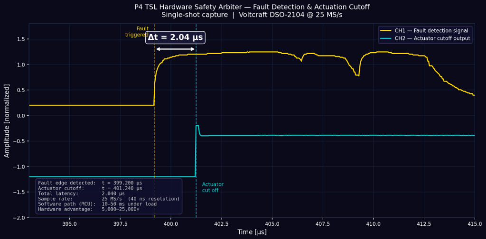
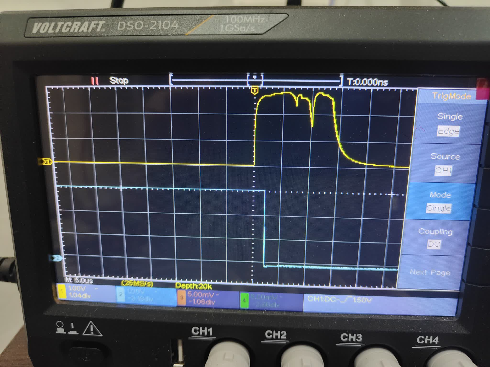

# P4 Thermodynamic Safety Layer (TSL) — Deterministic Hardware Safety Arbitration for Edge & IoT Actuators

**Abstract**  
This repository presents the physical validation and architectural framework of the P4 Thermodynamic Safety Layer (TSL). In modern edge computing and cyber-physical systems, safety-critical load isolation is commonly delegated to microcontroller unit (MCU) software routines. However, general-purpose microcontrollers suffer from non-deterministic worst-case execution time (WCET) introduced by interrupt preemption, DMA transfer stalls, cache misses, and software preemption. 

To resolve this vulnerability, the P4 TSL implements a hardwired, analog-to-logic safety function that operates completely independently of the software execution stack. Under critical threshold conditions, the TSL bypasses the MCU to trigger an immediate, unconditional shutdown reflex. Physical testing using a Voltcraft DSO-2104 oscilloscope (25 MS/s) demonstrates a total actuator loop cutoff latency of **2.04 µs**, providing a 5,000× to 25,000× speedup over traditional MCU interrupt-driven software loops (10–50 ms). This design realizes the physical safety decoupling principles defined in the IEC 61508 standard at commodity component costs (~$2 BOM), bridging the gap between high-level predictive intelligence and hardware-level determinism.

---

## Architecture: Hardware Reflexes, Software Intelligence

The P4 TSL separates cyber-physical operations into two decoupled layers:

1. **Intelligence Layer (Microcontroller):** Runs complex estimation algorithms (e.g., DWT, Random Forests), handles network communication, and performs edge inference. Because its execution environment is non-deterministic, software-based safety checks can be delayed or fail during CPU preemption, stack overflow, or firmware freeze.
2. **Safety Layer (Dedicated Hardware Logic):** A hardwired safety-detection and actuation override path. It operates without clock signals, memory buffers, or operating system layers, maintaining full functionality even during total MCU lockup.

```
┌─────────────────────────────────────────────────┐
│  INTELLIGENCE LAYER (Non-Deterministic WCET)    │
│  MCU / Edge CPU: WiFi, Algorithms, Inference     │
│         │ (Optional software-defined commands)   │
├─────────┼───────────────────────────────────────┤
│         ▼                                       │
│  SAFETY LAYER (Deterministic Hardware Override) │
│  Hardware Safety-Detection + Actuator Cutoff    │
│  Reaction: 2.04 µs (Unconditional, No Software) │
└─────────────────────────────────────────────────┘
```

* **Measured Response Latency:** **2.04 µs** (Full actuator loop response time)
* **Software Path Baseline:** 10–50 ms under load
* **Hardware Latency Advantage:** 5,000–25,000×

> **Intellectual Property Notice:**  
> The specific circuit topology and hardware-software integration interface are subject to a patent application filed with the Serbian Intellectual Property Office (priority date: November 27, 2025).

---

## Verification Waveforms

### 1. Physical Oscilloscope Capture
The waveform below, captured on a Voltcraft DSO-2104, displays the transition from the initial fault detection (CH1) to the final actuator cutoff (CH2), verifying the 2.04 µs response boundary.


### 2. Multi-Stage Timing Plot (From Real Binary Data)
The plot below, reconstructed from raw high-resolution measurement data (`data_201134.bin`), demonstrates the timing delta between the fault detection threshold and the final actuator cutoff event:



### 3. Physical Verification Setup
The photograph below shows the hardware testbench, including the breadboard prototype (featuring the safety-critical decoupling loop) connected to the Voltcraft DSO-2104 oscilloscope for latency measurements:



